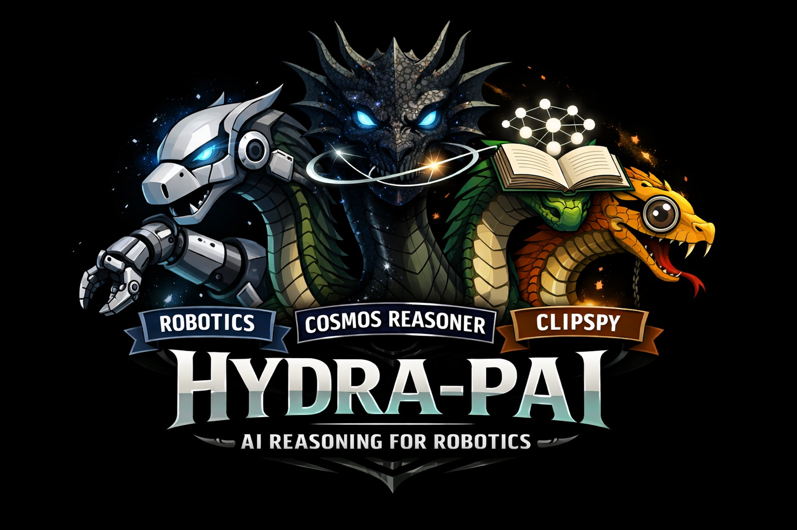
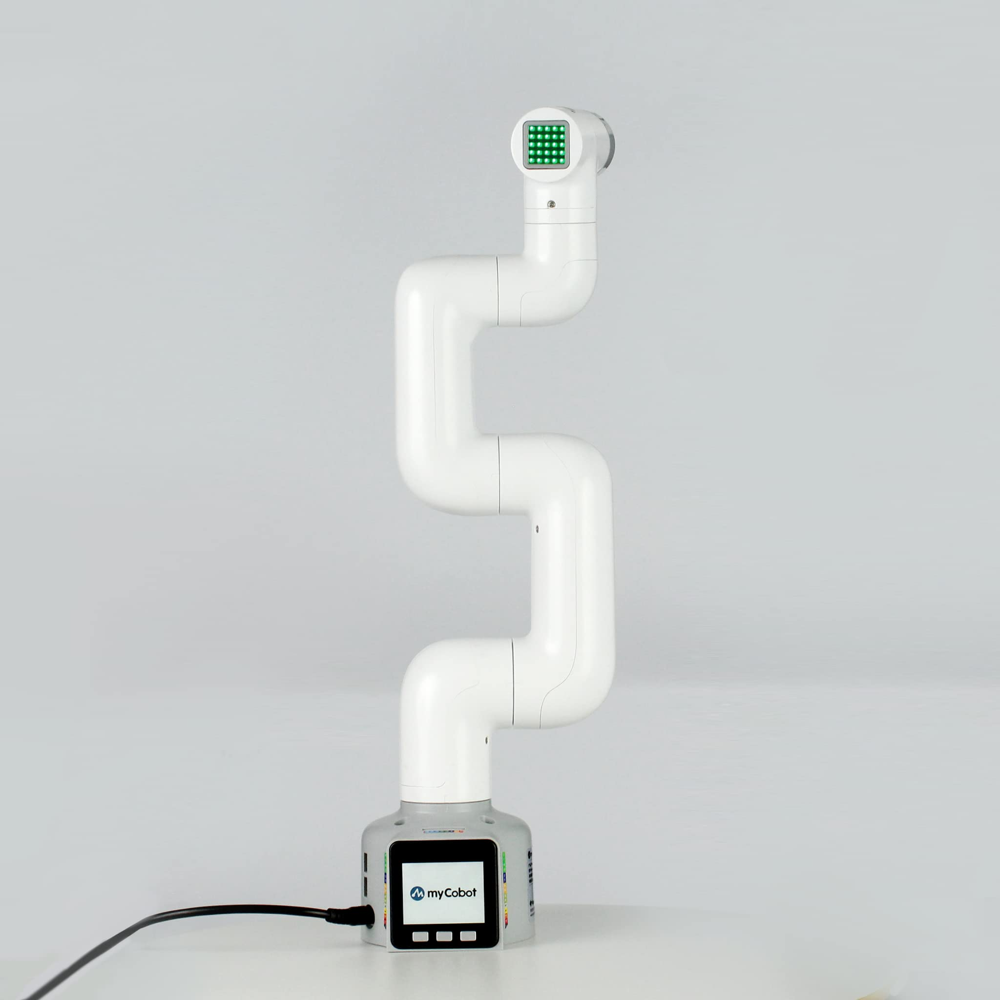
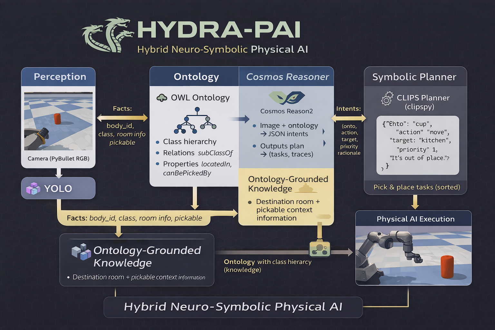
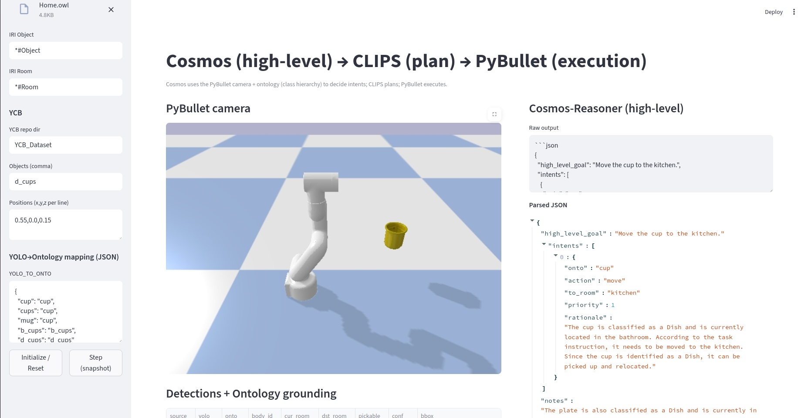
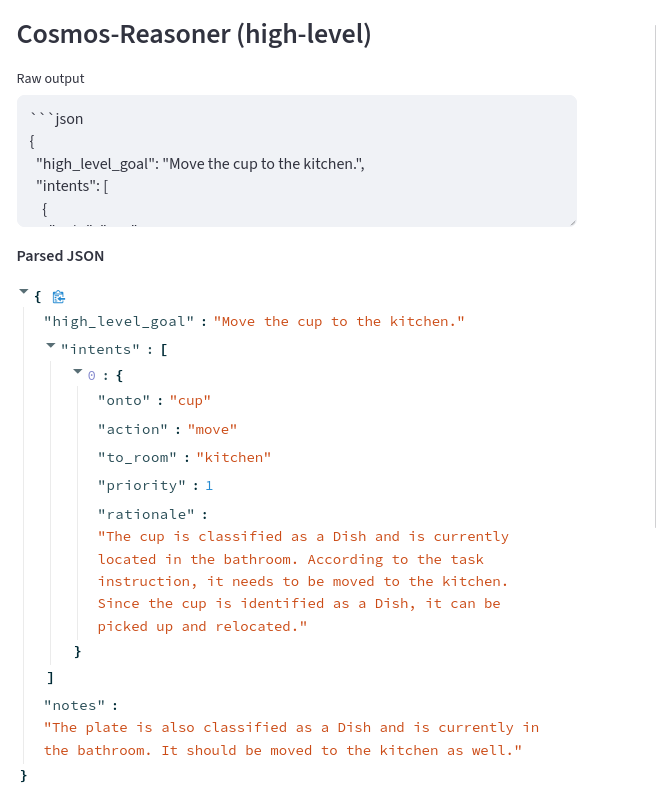
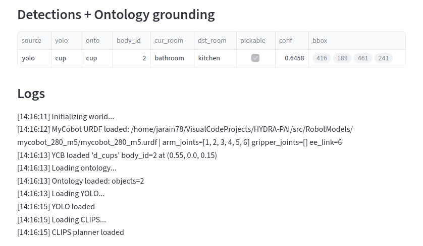
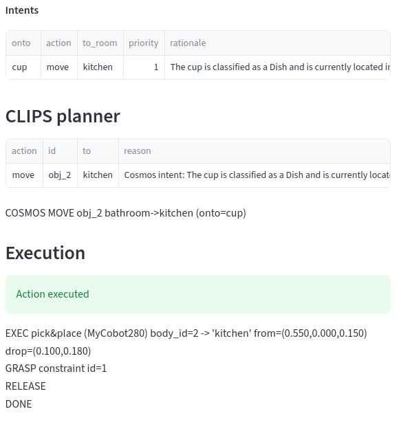

# The Hybrid Mind: Integrating Cosmos Reason2, Ontological Memory, and Symbolic Planning for Explainable Physical AI

  

## 📌 Submission Summary

This project presents a hybrid Physical AI architecture integrating NVIDIA Cosmos Reason2 with OWL ontologies and CLIPS symbolic planning. Cosmos acts as a high-level visual reasoner grounded on structured knowledge extracted from an ontology that encodes object-room relationships, pickability, and class hierarchy. The model outputs structured JSON intents, which are transformed into symbolic facts and processed by a CLIPS inference engine to generate ordered task plans with full traceability. A robotic manipulator in PyBullet executes these plans using inverse kinematics and smooth motion control. This integration demonstrates how foundation models gain robustness, explainability, and extensibility when paired with explicit knowledge representation and symbolic reasoning. Rather than relying solely on black-box perception, the system closes the loop from perception to physical action through interpretable planning. The Hybrid Mind showcases a scalable blueprint for trustworthy household and assistive robotics.

⚙️ **Current Implementation**

Currently, the system is fully operational in both simulated and real robotic environments through the scripts **`ontoai_dashboard_cosmos_clips_mycobot280.py`** and **`ontoai_dashboard_cosmos_clips_robot_select.py`**, which implement the complete **perception → reasoning → planning → execution** pipeline for the **MyCobot 280** platform.

These modules demonstrate the practical deployment of the architecture, enabling interactive experimentation with **hybrid neuro-symbolic reasoning** in robotic manipulation tasks.

🧠 **The Hybrid Mind** showcases a scalable blueprint for **trustworthy household and assistive robotics**, combining foundation models with explicit knowledge representation and symbolic planning.

# 📊 HYDRA-PAI Concept Infographics

A set of visual infographics explaining the key concepts of the **HYDRA-PAI architecture** is available in this repository.

These diagrams illustrate the interaction between perception, reasoning, ontology grounding, and robotic execution.

👉 **Open the infographic page:**  
[View Clips Concept Diagrams](docs/InfografiaClips.html)

[View Clipspy and Ontology Concept Diagrams](docs/InfografiaClispy.html)

---

**HYDRA‑PAI (Hybrid Reasoning Architecture for Physical AI)** demonstrates how foundation models become physically actionable when combined with structured knowledge and symbolic reasoning.

Unlike traditional robotics demos that stop at perception or captioning, this system closes the full loop:

**Perception → Reasoning → Knowledge → Planning → Physical Action**

---

# 🎥 Project Video

A demonstration video of the system can be found here:

(The video shows the full perception‑to‑execution pipeline running with the MyCobot 280 robot in simulation.)

The following video demonstrates how the HYDRA-PAI system works, illustrating the complete pipeline from perception to reasoning, knowledge integration, planning, and physical robotic action.

---

# 🤖 Robot Platform

The robotic manipulator used in this project is the [MyCobot 280 – Elephant Robotics](https://www.elephantrobotics.com/en/mycobot-280-m5-2023-en/), a lightweight 6‑DOF robotic arm widely used for research and education.

Key characteristics:

• 6 Degrees of Freedom  
• Python API integration  
• Compatible with PyBullet simulation  
• Compact and low‑cost research platform  

In this project the robot is primarily executed in **PyBullet simulation** to enable reproducible evaluation of the hybrid reasoning architecture.  
The system is also capable of **connecting to the real MyCobot 280 robot**, allowing the same perception → reasoning → planning pipeline to control a physical robotic manipulator.
---

# 🧠 Why Cosmos?

Most robotics pipelines treat foundation models as **perception tools**.  
In this project, **Cosmos Reason2 is used as a high‑level reasoning engine.**

Cosmos receives:

• Camera frame  
• Ontology knowledge summary  
• Grounded perception results  

It then produces **structured reasoning outputs** in JSON form that drive symbolic planning.

Cosmos therefore functions as:

**Visual Reasoner → Intent Generator → Semantic Bridge between perception and planning**

Benefits:

✔ Structured reasoning output  
✔ Reduced hallucinations through ontology grounding  
✔ Explainable decision generation  
✔ Compatible with symbolic planners

This demonstrates how **Cosmos can operate as the cognitive layer of a Physical AI system.**

---

# 🔬 System Architecture

## HYDRA‑PAI Architecture

Pipeline:

PyBullet Camera (RGB)  
↓  
YOLO Object Detection  
↓  
Ontology Grounding (OWLReady2)  
↓  
Cosmos Reason2 (High‑level reasoning)  
↓  
CLIPS Symbolic Planner  
↓  
PyBullet Robot Execution (IK)

---

# 🧩 Reasoning Pipeline

### 1 Perception

YOLO detects objects in the scene and maps them to simulated bodies.

### 2 Knowledge Grounding

The ontology provides semantic knowledge:

• object class hierarchy  
• room location knowledge  
• pickability constraints  

### 3 Cosmos Reasoning

Cosmos receives:

image + ontology summary + perception facts

Example output:

{
 "high_level_goal": "organize objects",
 "intents": [
   {"onto": "cup", "action": "move", "to_room": "kitchen", "priority": 1}
 ]
}

### 4 Symbolic Planning

CLIPS converts intents into deterministic tasks.

Example rules:

• Not pickable → ignore  
• Wrong location → move  
• Already correct → ignore  

### 5 Physical Execution

The PyBullet robot executes the plan using inverse kinematics and smooth trajectories.

---

# 📊 Benchmark Comparison

| Capability | Vision‑Only Systems | HYDRA‑PAI |
|-------------|--------------------|-----------|
Object Detection | ✔ | ✔ |
Captioning | ✔ | ✔ |
Structured Reasoning | ✖ | ✔ |
Ontology Knowledge | ✖ | ✔ |
Symbolic Planning | ✖ | ✔ |
Explainability | ✖ | ✔ |
Physical Task Execution | Limited | ✔ |

HYDRA‑PAI demonstrates that combining foundation models with symbolic reasoning significantly increases system **interpretability and robustness**.

---

# ⚙️ Quickstart

Install dependencies:

pip install streamlit pybullet owlready2 clipspy ultralytics transformers torch imageio imageio-ffmpeg pillow

Run:

streamlit run src/ontoai_dashboard_streamlit_mycobot280.py

---

# 🧩 Why Ontologies?

Ontologies allow the robot to reason about **semantic relationships** without retraining neural models.

Advantages:

• Hierarchical reasoning  
• Domain extensibility  
• Explainable constraints  
• Cross‑domain adaptability

Expanding the ontology automatically expands the robot's knowledge.

---

# 🔮 Future Work

Planned research directions:

• Multi‑object task scheduling  
• Safety constraints derived from ontology knowledge  
• Multi‑robot reasoning  
• Real‑robot deployment using ROS2  
• Persistent knowledge learning from experience  

The architecture is also being extended to support **multiple robotic platforms**, allowing the same reasoning system to control different robots beyond the **MyCobot 280**.

Additional manipulators and mobile robots are currently being integrated.

---

---

# 📷 System Interface Gallery

The HYDRA-PAI interface shows the full hybrid reasoning pipeline from perception to physical execution.

### Cosmos Reasoning Output

The Cosmos Reason2 model produces structured JSON intents that describe the high-level goal and the reasoning behind each action.

---

### Ontology Grounding + Perception

Detected objects are grounded into the ontology, providing semantic context such as room location and object class hierarchy.

---

### Symbolic Planning (CLIPS)

The CLIPS inference engine converts high-level intents into deterministic symbolic tasks.

---

### Physical Execution

The robot executes the plan in PyBullet using inverse kinematics and grasp constraints.

---

# 📌 Contribution Summary

HYDRA‑PAI introduces a hybrid Physical AI architecture combining:

• Cosmos Reason2 foundation reasoning  
• OWL ontology knowledge representation  
• CLIPS symbolic planning  
• PyBullet robotic manipulation

This architecture demonstrates how **foundation models become reliable controllers for physical systems when grounded in structured knowledge and symbolic reasoning.**

---

# 📜 License

CC BY‑NC‑SA 4.0

Non‑commercial academic use permitted.

---

# Acknowledgements

NVIDIA Cosmos Reason2  
OWLReady2  
CLIPS / clipspy  
PyBullet  
Ultralytics YOLO

---

# 🌐 Connect with the Author

If you are interested in **Explainable Physical AI, Robotics, and Hybrid AI architectures**, feel free to connect.

🌍 **Website**  
https://www.jaimerincon.dev/

🎥 **YouTube Channel**  
https://www.youtube.com/@78Jarain

💼 **LinkedIn**  
https://www.linkedin.com/in/jaime-andres-rincon-arango-11a1522b/

📚 **Research / Publications**  
https://scholar.google.es/citations?user=JEoZvGAAAAAJ&hl=es

💻 **GitHub**  
https://github.com/jarain78